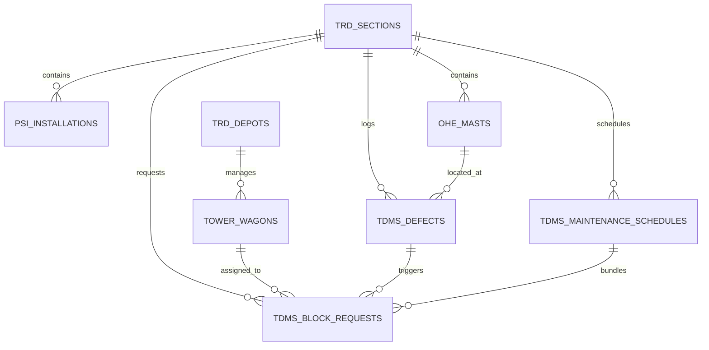

# TDMS Data & Schema Integration Guide for SIH Problem Statement 26027

> **Problem Statement**: **SIH26027** - *AI-Powered Automatic Block Planning to Maximize Asset Availability for Train Operations on Indian Railways*  
> **Target Subsystem**: **TDMS (Traction Distribution Management System)** — Indian Railways Overhead Equipment (OHE) & Power Supply Installations (PSI).

---

## 1. Overview & System Context

In Indian Railways, **Traction Distribution (TRD)** manages high-voltage electrical infrastructure (25 kV AC / 2x25 kV AC) powering electric locomotives. The **TDMS (Traction Distribution Management System)** tracks:

1. **OHE (Overhead Equipment)**: Catenary wire, contact wire, droppers, cantilevers, insulators, neutral sections, section insulators, mast stagger/height.
2. **PSI (Power Supply Installations)**: Traction Substations (TSS), Sectioning Posts (SP), Sub-Sectioning Posts (SSP), Switchgear, Circuit Breakers, Interrupters.
3. **TRD Maintenance Resources**: 8-Wheeler NETRA Tower Wagons, 4-Wheeler Wagons, TRD Depots, Foot Patrol teams.
4. **Defects & Condition Monitoring**: NETRA thermovision hot-spot detection, contact wire wear, insulator flashovers, bird nesting, vegetation encroachment.
5. **Routine & Preventive Maintenance**: Monthly, Quarterly, Half-Yearly, Annual, IOH, and POH schedules.
6. **Power Block Requests**: Demands for electrical isolation of catenary sections (Power Blocks) or joint Traffic + Power Blocks submitted to BDMS (Block Demand Management System) / COA (Control Office Application).

---

## 2. Relational Database Schema (`tdms_schema.sql`)

The dataset schema is structured into **8 primary entities**:



### Table Summary:
1. `trd_zones` & `trd_divisions`: Administrative structure (e.g., Central Railway `CR`, Nagpur Division `NGP`).
2. `trd_sections`: Electrified railway corridors with KM chainages (e.g., `SEC_NGP_WR_UP` from KM 785.0 to KM 864.0).
3. `psi_installations`: Traction Substations (`TSS`), Sectioning Posts (`SP`), Sub-Sectioning Posts (`SSP`).
4. `ohe_masts`: Detailed mast catalog (e.g., Mast `245/12`, Stagger, Wire spec, Height).
5. `trd_depots` & `tower_wagons`: Maintenance equipment & 8W NETRA wagons.
6. `tdms_defects`: Active defect registry (Severity: `CRITICAL`, `HIGH`, `MEDIUM`, `LOW`, Work Duration, Power Block requirement).
7. `tdms_maintenance_schedules`: Preventive check schedules with computed `overdue_days` and `urgency_score`.
8. `tdms_block_requests`: Consolidated power block requirements output by TDMS for entry into the SIH 26027 Block Planner.

---

## 3. Data Dictionary for Key Integration Fields

| Field Name | Type | Description / Integration Utility in SIH26027 |
| :--- | :--- | :--- |
| `section_id` | `VARCHAR(20)` | Identifies the physical corridor section. Used to cross-reference TMS (Track) & SMMS (Signals). |
| `start_km` & `end_km` | `DECIMAL(8,3)` | Kilometric bounds of the requested power isolation zone. |
| `severity` | `ENUM` | `CRITICAL`, `HIGH`, `MEDIUM`, `LOW`. Critical severity demands highest AI priority weight ($W_{sev} = 1.0$). |
| `power_block_required` | `BOOLEAN` | If `true`, requires OHE power isolation via SCADA / SP / SSP isolation switches. |
| `traffic_block_required` | `BOOLEAN` | If `true`, requires stopping train movement on the affected line. |
| `estimated_work_duration_minutes` | `INT` | Minimum duration (e.g. 120 - 240 mins) required for the block window. |
| `tower_wagon_required` | `BOOLEAN` | Constraint checking: block cannot proceed unless a Tower Wagon (`tw_id`) is available at the depot. |
| `overdue_days` & `urgency_score` | `NUMERIC` | Used in the optimization function: $\text{Priority} = f(\text{Severity}, \text{Overdue Days}, \text{Corridor Traffic Density})$. |

---

## 4. Code & Data Files Included in Workspace

The following assets have been generated in your workspace:

1. **[tdms_schema.sql](file:///E:/sih2026/tdms_schema.sql)**: Full SQL DDL script for PostgreSQL / MySQL / SQLite.
2. **[generate_tdms_data.py](file:///E:/sih2026/generate_tdms_data.py)**: Python generator script creating synthetic Indian Railways TRD data.
3. **[tdms_data.json](file:///E:/sih2026/tdms_data.json)**: Fully populated JSON dataset ready for API consumption.
4. **[tdms_database.db](file:///E:/sih2026/tdms_database.db)**: SQLite database pre-filled with TRD assets, defects, schedules, and block requests.
5. **[tdms_api_schema.json](file:///E:/sih2026/tdms_api_schema.json)**: OpenAPI / JSON Schema definition for REST API endpoints.

---

## 5. Integrating TDMS with TMS, SMMS & AI Block Planner (PS 26027)

```
 +------------------+     +------------------+     +------------------+
 |  TMS (Track)     |     |  SMMS (Signals)  |     |   TDMS (TRD/OHE) |
 |  - Rail defects  |     |  - Point machine |     |  - Catenary wear |
 |  - TGI / Weld    |     |  - Axle counters |     |  - Overdue POH   |
 +--------+---------+     +--------+---------+     +--------+---------+
          |                        |                        |
          +-------------------+    |    +-------------------+
                              v    v    v
                    +--------------------------+
                    |  Unified Multi-Dept      |
                    |  Data Ingestion Engine   |
                    +------------+-------------+
                                 |
                                 v
                    +--------------------------+
                    |  AI Block Optimizer      |
                    |  (ILP / Reinforcement L.)|
                    +------------+-------------+
                                 |
                                 v
                    +--------------------------+
                    | Integrated Multi-Dept    |
                    | Optimal Block Schedule   |
                    +--------------------------+
```

### Integration Steps:
1. **Load Data**: Import `tdms_data.json` or query `tdms_database.db`.
2. **Corridor Grouping**: Group TDMS defects, TMS track defects, and SMMS signal maintenance tasks by `section_id`, `track_line`, and overlapping `start_km` / `end_km`.
3. **Shadow Block Optimization**: If TMS requires a Track Block at KM 800-805, the AI optimizer identifies TDMS maintenance tasks on the same section and schedules a **Shadow Power Block** simultaneously, saving train line downtime.
4. **Tower Wagon Routing**: Match `tower_wagon_required` tasks with available `tower_wagons` based on `depot_id` location.
