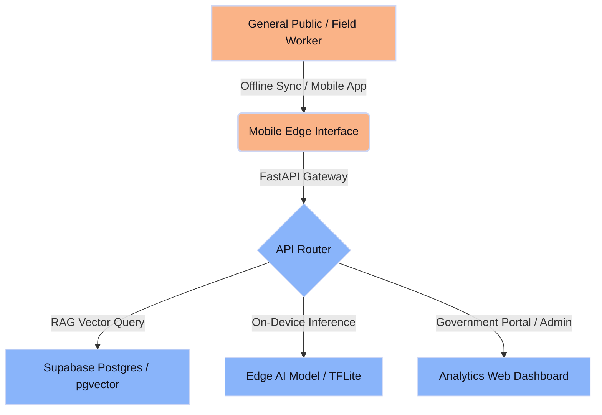
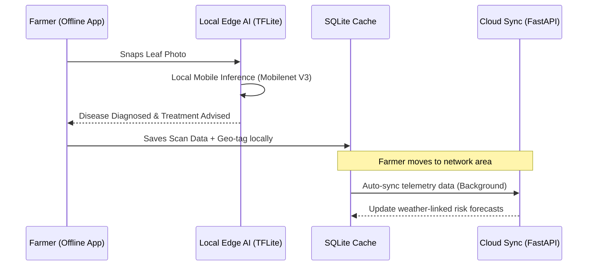
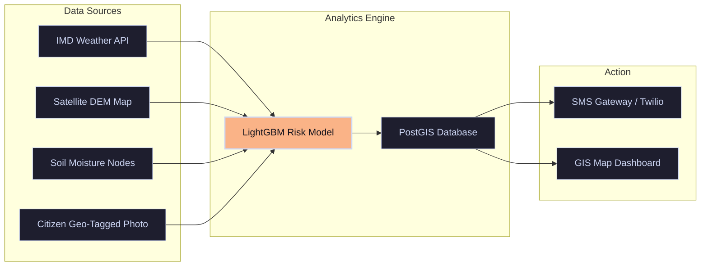

# SIH 2026: Winning Architectural Blueprints & Standout Strategies

To stand out from **10 lakh students and teams** in the Smart India Hackathon 2026, you cannot build a generic, CRUD-based web application with mock data. You must build a **production-grade, resilient, and visually stunning system** that implements state-of-the-art architectures.

This document provides the exact system blueprints, technical stacks, Mermaid data flows, and **"10 Lakh Teams Standout Strategies"** (USPs) for our 8 recommended problem statements.

---

## 🏆 Standout Strategy: The Core Pillars of a Winning Proposal
No matter which problem statement you select, integrating these three pillars will instantly put you in the top 1% of submissions:

1. **Bhashini API Integration (Digital India Initiative):** Government evaluators love alignment with official initiatives. Using Bhashini for real-time speech-to-speech translation in local Indian dialects is a massive differentiator for rural/SC community projects.
2. **Offline-First & Low-Bandwidth Synchronization:** Rural and disaster-affected zones have poor internet. Implementing local caching (SQLite/Hive) with conflict-free replication (CRDTs or robust queue syncing) shows true field feasibility.
3. **On-Device Edge AI (TinyML):** Running lightweight ML models (TensorFlow Lite, ONNX Runtime) directly on mobile devices or edge hardware (ESP32) eliminates cloud costs and latency, making your solution highly deployable.

---

## 🗺️ Architectural Blueprints for the Top Recommendations

---

### 1. PS ID 26003: Cognitive Gaming & Memory Assistance for Elderly Dementia Patients (MDoNER)

#### ⚙️ The System to Build
A **gamified mobile application** for dementia patients containing cognitive exercise modules (face recall, pattern matching, speech pronunciation) integrated with a **web-based analytics portal** for family members, caregivers, and medical practitioners to track cognitive decline.

#### 🛠️ Concrete Technical Stack
* **Frontend Mobile (Patient):** Flutter (for cross-platform fluid micro-animations) or React Native.
* **Backend Gateway:** FastAPI (Python) for asynchronous endpoints.
* **Database & Auth:** Supabase (PostgreSQL) + Real-time subscriptions for caregiver alerts.
* **AI/ML Engine:** 
  * *Face-Recall Module:* OpenCV & Face_Recognition library (running locally on device).
  * *Progressive Decline Modeling:* Scikit-learn (random forests/regression) analyzing game play patterns (latency, error rate, motor precision).
* **Local Caching:** Hive (NoSQL local DB for offline play).

#### 🚀 10 Lakh Teams Standout Strategy (USPs)
* **Motor Tremor Detection:** Use the mobile device's accelerometer and gyroscope to detect micro-tremors while the patient interacts with the screen, plotting motor stability over time.
* **Empathetic Voice Customization:** Allow family members to record voice prompts (e.g., "Good morning, Dad!") in local languages, which the AI engine automatically stitches into games instead of generic robotic voices.
* **Aphasia Assistant:** Include an AI-driven visual word-finder tool that uses the camera to help patients identify everyday household objects when they experience word-finding difficulties.

---

### 2. PS ID 26180: Smart Farming Assistant for Disease & Nutrient Detection (Agriculture)

#### ⚙️ The System to Build
An **offline-first Mobile Assistant (Android)** that operates in remote farmlands without internet connection. Farmers snap photos of crop leaves to get instant, local diagnostic results and treatment pathways, which sync to a **regional agricultural command dashboard** once connectivity is restored.

#### 🛠️ Concrete Technical Stack
* **Frontend Mobile:** Kotlin (Android Native) or Flutter.
* **Edge AI Engine:** TensorFlow Lite (TFLite) compiling a custom-trained **MobileNetV3** model.
* **Database:** SQLite (local SQL helper) + PostgreSQL (cloud database).
* **Backend:** FastAPI wrapped in Docker.
* **APIs:** Indian Meteorological Department (IMD) API for hyper-local weather risk forecasting.

#### 🚀 10 Lakh Teams Standout Strategy (USPs)
* **On-Device Quantization:** Quantize your PyTorch models to 8-bit integers (INT8 quantization). This reduces the model size from 100MB to ~15MB, allowing it to run smoothly on budget Rs. 8,000 smartphones without lagging.
* **SMS-Fallback Diagnostic:** If the farmer has a basic feature phone or zero internet, implement a Twilio/SMS gateway. The farmer sends key descriptors via SMS, and a lightweight LLM parses the text and texts back a local language remedy.
* **Geospatial Disease Heatmaps:** Use Leaflet.js on the admin portal to show where crop diseases are spreading, enabling local authorities to issue early warnings to neighboring villages.

---

### 3. PS ID 26038: Explainable AI for Diabetic Retinopathy Screening in Rural India (Healthcare)

#### ⚙️ The System to Build
An **AI-driven diagnostic tablet/web application** for rural ASHA (Accredited Social Health Activist) workers. By attaching a low-cost fundus camera to a smartphone, the system takes retinal images, runs screening AI, and outputs a diagnostic probability map.

#### 🛠️ Concrete Technical Stack
* **Frontend UI:** Next.js (React) + Tailwind CSS + Radix UI.
* **Backend & ML API:** FastAPI + PyTorch.
* **ML Model:** **EfficientNet-B4** fine-tuned on the APTOS 2019 Blindness Detection dataset.
* **Explainability Model:** **Grad-CAM** (Gradient-weighted Class Activation Mapping).
* **PDF Report Generator:** ReportLab (Python) for standard medical audit PDFs.

#### 🚀 10 Lakh Teams Standout Strategy (USPs)
* **Visual Trust via Grad-CAM:** Standard AI just gives a percentage (e.g., "Mild: 82%"). To stand out, overlay a heatmap on the retinal image showing the doctor exactly *where* the micro-aneurysms or hemorrhages are located.
* **DICOM Compatibility:** Support standard medical DICOM file formats and integrate with Ayushman Bharat Digital Mission (ABDM) sandbox APIs for mock health-ID linking.
* **Adversarial Quality Control:** Build a pre-processing filter that checks if the eye image is blurry, out-of-focus, or has bad lighting *before* running the AI, telling the user to "Re-take photo" to avoid false classifications.

---

### 4. PS ID 26097: Livelihood Mapping & Skilling Recommendations Voice Assistant (SC Communities)

#### ⚙️ The System to Build
An **interactive voice-response (IVR) and web portal** designed for marginalized SC communities. Users register and query the system using native speech (Hindi, Bengali, Tamil, etc.), and the AI maps their skills to active jobs, National Skill Qualification Framework (NSQF) courses, and PM-AJAY grants.

#### 🛠️ Concrete Technical Stack
* **Conversational Core:** Rasa NLU or LangChain agentic workflow.
* **Translation & Voice:** **Bhashini API** (Government of India) or open-source Coqui TTS/Whisper.
* **Database & Vector Search:** PostgreSQL with the **pgvector** extension for semantic matching.
* **Frontend:** Vite + React + Tailwind CSS with Web Speech API for voice triggers.

#### 🚀 10 Lakh Teams Standout Strategy (USPs)
* **Dialect-Resilient Speech (Bhashini integration):** Instead of standard Google Translate, use Bhashini's speech-to-text endpoints. This allows users to speak in rural regional dialects, converting it to standard text for matching.
* **Graph-Based Skill Progressions:** Use Neo4j or network graphs on the dashboard to show pathways: e.g., if a user knows "Basic Sewing", the map visually recommends "Industrial Textile Design" and links it to PM-AJAY funding.
* **WhatsApp Voice-Bot:** Since many rural users only use WhatsApp, implement a WhatsApp API bot where users send voice notes and receive matching jobs and courses directly on chat.

---

### 5. PS ID 26092: AI-Driven Scheme Matching for Marginalized Entrepreneurs (Cooperation)

#### ⚙️ The System to Build
A **Retrieval-Augmented Generation (RAG) platform** that ingests raw PDF/doc files of state and central government schemes, profiles marginalized micro-entrepreneurs via simple questions, and matches them to schemes with an AI explanation of eligibility.

#### 🛠️ Concrete Technical Stack
* **Vector Database:** Qdrant or Pinecone.
* **LLM Engine:** Llama-3 (Sovereign open-weight) or GPT-4o-mini API.
* **RAG Framework:** LlamaIndex or LangChain.
* **Frontend:** Next.js with shadcn/ui.
* **Deployment:** Docker + local deployment ready.

#### 🚀 10 Lakh Teams Standout Strategy (USPs)
* **Eligibility Gap Analysis:** When a user is rejected from a scheme, don't just say "Ineligible". Provide a clear AI-generated checklist of what they are missing (e.g., "You need to register under Udyam. Here is the link to register").
* **Multi-source Web Scraper:** Include a background worker using Celery + BeautifulSoup that scrapes official government portals (`myscheme.gov.in`) daily, updating the vector database dynamically so the schemes are never outdated.
* **One-Click Form Filler:** Use AI to automatically extract details from uploaded documents (Aadhaar, Caste Certificate, PAN) to pre-fill the scheme application forms, saving time for marginalized individuals.

---

### 6. PS ID 26089: Cooperative Gig Services Platform for Community Services (Cooperation)

#### ⚙️ The System to Build
A **location-based mobile and web marketplace** matching cooperative household workers (plumbers, carpenters, domestic help) to consumers, featuring a **transparent cooperative dividend-sharing ledger**.

#### 🛠️ Concrete Technical Stack
* **Frontend App:** React Native / Expo.
* **Geolocation Engine:** Leaflet + OpenStreetMap (using OSRM for route optimization).
* **Backend:** Node.js (NestJS) or Go (Golang) for high-concurrency request handling.
* **Database:** PostgreSQL with PostGIS extension for geo-spatial querying.
* **Real-time Engine:** Socket.io for driver/worker tracking.

#### 🚀 10 Lakh Teams Standout Strategy (USPs)
* **Democratic Co-op Dividend Engine:** Unlike corporate apps that take 30% commissions, this platform splits commissions. Build an automated accounting ledger showing how 5% of monthly revenue is deposited into the "Cooperative Welfare & Pension Fund" and distributed transparently.
* **SOS Panic Button with Mesh Routing:** If a domestic helper feels unsafe, pressing a panic button triggers an alert to nearby cooperative workers and local police. If internet is down, it triggers localized BLE (Bluetooth Low Energy) mesh alerts.
* **Voice-Guided Job Dispatch:** Dispatch jobs via automated robocalls to workers who cannot read mobile notifications, allowing them to accept or reject work by pressing "1" or "2" on their phones.

---

### 7. PS ID 26001: Landslide Early Warning & Risk Monitoring System in NER (MDoNER)

#### ⚙️ The System to Build
A **GIS-based digital twin platform** that visualizes landslide risks in the North Eastern Region using remote-sensing weather data, digital elevation models, and citizen reports, delivering warnings via an automated SMS dispatch system.

#### 🛠️ Concrete Technical Stack
* **GIS Engine:** Leaflet.js with **GeoJSON** layers for road blockages and village boundaries.
* **Machine Learning:** LightGBM or XGBoost classifier predicting hazard indices.
* **Backend Pipeline:** Python (Celery for asynchronous processing of satellite and sensor feeds).
* **SMS Gateway:** Twilio API or local Indian SMS API (Gupshup).

#### 🚀 10 Lakh Teams Standout Strategy (USPs)
* **Crowdsourced Photo Metadata Extraction:** When a local citizen uploads a photo of a crack on a hill slope, use Exif metadata to extract the exact GPS coordinates and orientation, automatically placing a marker on the admin's GIS map.
* **Hydrological Rainfall-Threshold Modeling:** Implement a physical model (Caine's threshold formula: $I = a \cdot D^b$) that dynamically updates risk profiles based on cumulative rainfall over the last 72 hours, warning villages *before* the landslide happens.
* **Emergency Route Optimization:** During a road-block landslide, run Dijkstra's shortest-path algorithm using OpenRouteService to show rescue teams alternative, safe passage roads.

---

### 8. PS ID 26040: Smart Water Purification & Quality Monitoring System (Mines/Water)

#### ⚙️ The System to Build
An **IoT-Software hybrid platform**. Physical water testing canisters equipped with sensors collect water quality metrics in mining-affected zones, transmitting live telemetry to a centralized **national water safety dashboard**.

#### 🛠️ Concrete Technical Stack
* **Micro-controller Hardware:** ESP32 with Wi-Fi/LoRa modules.
* **Sensors:** Analog pH sensor, TDS (Total Dissolved Solids) sensor, Turbidity sensor, Temperature sensor.
* **Communication Protocol:** MQTT (using Mosquitto broker) for lightweight telemetry.
* **Frontend Admin Portal:** Vite + React + Recharts (for real-time telemetry line graphs).
* **Database:** InfluxDB (optimized for time-series sensor data) or Supabase.

#### 🚀 10 Lakh Teams Standout Strategy (USPs)
* **Anomalous Sensor Detection (Auto-Calibration):** Sensor probes degrade over time. Build an isolation forest ML model on the cloud that detects if a sensor is reporting faulty values due to degradation (e.g. drift or flatlining) and triggers a maintenance ticket automatically.
* **LoRaWAN Mesh Network Simulation:** In deep mines or rural valleys, there is no cellular network. Connect multiple ESP32 nodes using LoRa mesh protocols, showing how data hops from canister to canister until it reaches an internet-connected gateway.
* **Water Safety Index Calculator:** Translate raw metrics (pH, TDS, turbidity) into a singular, human-readable **Water Quality Index (WQI)** color code (Green = Safe, Yellow = Boil first, Red = Toxic).

---

## 📈 Guide: Crafting a Visually Premium Presentation

When building your slide deck and live web demos, avoid generic templates:
1. **Choose Curated Palettes:** Use modern Tailwind CSS palettes (like Slate/Indigo or Catppuccin Mocha colors) instead of raw RGB colors.
2. **Typography Matters:** Load premium typography (like **Inter** or **Plus Jakarta Sans** from Google Fonts) to make your text look modern and readable.
3. **Show, Don't Tell:** Replace bullet points with flow diagrams (using Mermaid syntax or clean vector icons) and visual mockups.
